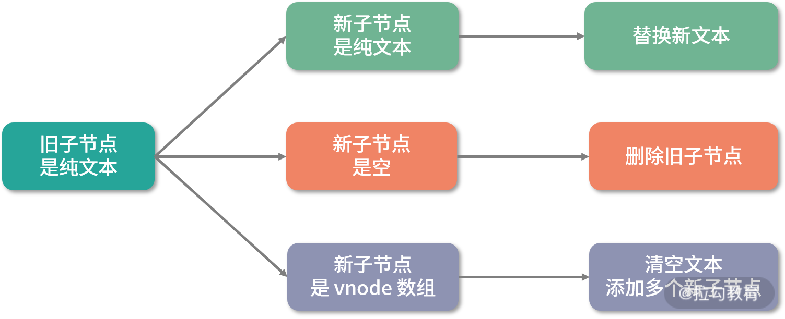

### Vue源码浅析

entry-runtime-with-compiler.js

render -> template -> el

if (template) -> compile(template) as render

扩展$mount方法，解析模板，得到渲染函数   -> 调用函数（web/runtime/index.js） 安装_patch_方法  实现$mount   -> core/index 全局方法初始化

-> instance 构造函数  执行初始化  -> init

new Vue发生了什么事情   ->  初始化

## vue3.0源码
- createApp 初始化 -> 创建app对象和重写app.mount（为什么会重写app.mount: 重写app.mount是为了跨平台，createApp内部写的是标准化渲染vnode）

- 创建vnode，vnode是对抽象事物的描述，是对象的形式

    vnode优势：1、抽象  2、跨平台  3、并不是vnode性能就比操作原生dom快

    createVNode -> 对props标准化处理、vnode类型编码 -> 创建vnode、标准化子节点

- 渲染vnode
    render -> 组件为空则创建(这个过程中创建了一个副作用函数，用来更新，只要数据发生变化，就会执行一次副作用函数) -> 不为空则patch
    patch过程
        1: 根据vnode挂载dom
        2: 新旧vnode对比更新dom

### 组件拆分越细越好吗
    组件不是拆分越细越好，组件可以看做是一个模块，只有一些公共的,或者功能相类似的可以提取为组件使用，因为组件越细的话，渲染会先通过renderComponentRoot去生成组件vnode，在递归patch生成subTree的vnode，这个过程需要消耗性能，所以划分粒度不是越细越好

### diff过程
    patch -> 新旧节点对比: 类型不同，则直接删除旧节点挂载新节点
    类型相同，走diff流程

    diff 是一个深度优先遍历的过程

    元素子节点vnode对比有9种情况
    vnode节点为文本：
    

    vnode节点为空：
    

    vnode节点为数组：
    

const middleTraves = (root) => {
    const result = []
    const per = (node) => {
        if (node) {
            result.push(node.left)

            per(node.val)

            per(node.right)
        }
    }
    per(root.left)
    return result
}

[3,9,20,null,null,15,7]

const levelOrderBottom = (root) => {
    if (!root) return []
    let res = [], queue = [root]
    while (queue.length) {
        let cur = [], temp = []
        while(queue.length) {
            let node = queue.shift()
            cur.push(node.val)
            if (node.left) temp.push(node.left)
            if (node.right) temp.push(node.right)
        }
        res.push(cur)
        queue = temp
    }
    return res.reverse()
}

function treeNode (val){
    this.val = val
    this.left = this.right = null
}

const buildTree = (pre, ino) => {

}