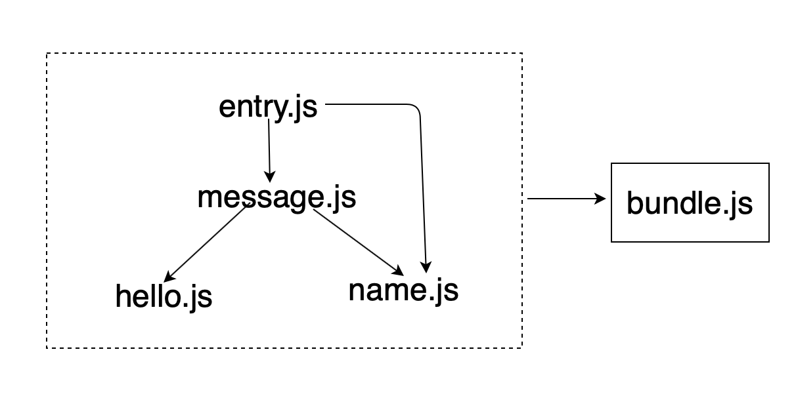

# 打包器
所谓打包器，就是前端开发人员用来将 JavaScript 模块打包到一个可以在浏览器中运行的优化的 JavaScript 文件的工具

### 如何打包


* 解析入口文件，获取所有依赖项
    - 获取文件内筒
    - 获取其依赖模块的相对地址

* 递归解析所有依赖项，生成一个依赖关系图

    我们已经确定了模块的表示，那怎么才能将这所有的模块关联起来，生成一个依赖关系图，通过这个依赖关系可以直接获取所有模块的依赖模块、依赖模块的代码、依赖模块的来源、依赖模块的依赖模块。

    #### 如何去维护依赖文件间的关系

    现在对于每一个模块，可以唯一表示的就是 filename ，而我们在由入口文件递归解析时，我们可以获取到每个文件的依赖数组 dependencies ，也就是每个依赖项的相对路径，所以我们需要定义一个：
    ```js
        // 依赖关系
        let mapping = {}
    ```
    用来在运行代码时，由 import 相对路径映射到 import 绝对路径。

    所以我们模块可以定义为[filename: {}]：

    ```js
        // 模块
        'src/entry': {
            code: '', // 文件解析后内容
            dependencies: ["./message.js"], // 依赖项
            mapping:{
                "./message.js": "src/message.js"
            }
        }
    ```
    则依赖关系图为：

    ```js
        // graph 依赖关系图
        let graph = {
            // entry 模块
            "src/entry.js": {
                code: '',
                dependencies: ["./src/message.js"],
                mapping:{
                "./message.js": "src/message.js"
                }
            },
            // message 模块
            "src/message.js": {
                code: '',
                dependencies: [],
                mapping:{},
            }
        }
    ```
* 使用依赖图，返回一个可以在浏览器运行的JavaScript文件

    现今，可立即执行的代码形式，最流行的就是 IIFE（立即执行函数-就是在声明市被直接调用的匿名函数，由于 JavaScript 变量的作用域仅限于函数内部，所以你不必考虑它会污染全局变量），它同时能够解决全局变量污染的问题。

* 输出到指定文件

    fs.writeFile 写入 dist/bundle.js 即可。


编写一个minipack项目，可参考 **[minipack:](https://github.com/sisterAn/blog/issues/69)**
